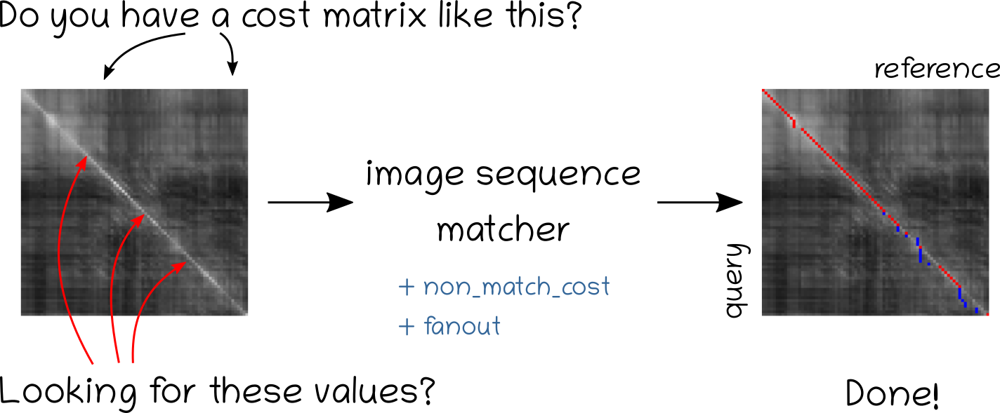

# Image sequence matcher

Finds the image matches between two sequences of images given a similarity (cost) matrix.

Particularly suited for image sequences matching in context of visual place recognition in changing environments.



:red_circle: (Red) - found image correspondences. :large_blue_circle: (Blue) - skipped image correspondences.

## Requirements
To run you need:
```bash
Python3
matplotlib
numpy
```

## How to run?
Have a look to a demo.

## Parameters
To run the code you need to specify `non_matching_cost` and `fanout` parameters.
For detailed explanation of the parameters, please see **Relevant publication**.

**Warning**. This code makes the following assumptions:

	* the better two images match, the smaller the cost should be.
	* all the costs (matrix elements) should be positive.

Intuitively:

`fanout` specifies speed of your camera in images. In terms of matrix pattern is the maximum possible inclination of the path. Typical value is 5.

`non_matching_cost` is a threshold after which the cost of matching two images is too high for images to be considered as match. For example `non_matching_cost = 3.4` means that every image pair within the shortest path that has a matching cost more than 3.4 is not considered as match (hidden), all that have cost less than 3.4 are considered as match.


## Relevant publication :point_down:
This framework builds a graph structure given a cost matrix. Afterwards it searches for the shortest path in the graph using a topological sorting approach. The resulting path gives the image associations between the sequences.

For more details how to build the graph please see the paper [Efficient  and  Effective  Matching  of  Image  Sequences
Under  Substantial  Appearance  Change](http://www.ipb.uni-bonn.de/wp-content/papercite-data/pdf/vysotska15icra.pdf).
This code only partially implements the paper though. It will only find the continuous path.

If you have loops in the sequences consider this [project](https://github.com/PRBonn/vpr_relocalization).